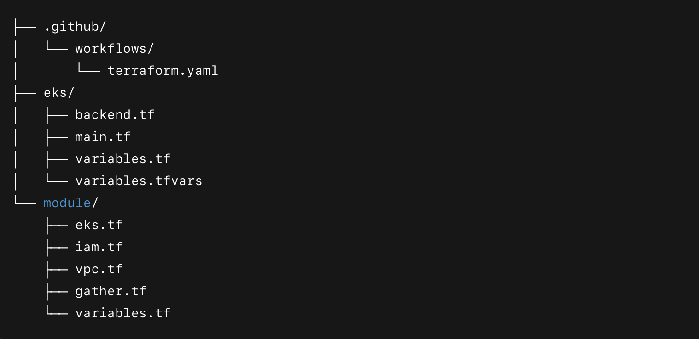

🚀 Project: Automating EKS Cluster Deployment with Terraform and GitHub Actions

Overview

This project focuses on provisioning a production-ready Amazon Elastic Kubernetes Service (EKS) cluster using Terraform, complemented by a GitHub Actions workflow for continuous integration and deployment (CI/CD). The infrastructure is designed for scalability, security, and automation, adhering to best practices in cloud-native deployments.

Key Features

Infrastructure as Code (IaC): Utilizes Terraform to define and manage AWS resources, ensuring consistent and repeatable deployments.
Modular Architecture: Implements a modular structure separating concerns such as networking, IAM roles, and EKS configurations for better maintainability.
CI/CD Pipeline: Integrates GitHub Actions to automate the deployment process, including plan, apply, and destroy stages, triggered via workflow dispatch with customizable inputs.
Secure State Management: Stores Terraform state files in an encrypted S3 bucket with state locking enabled through DynamoDB to prevent concurrent modifications.
Scalable Node Groups: Configures both On-Demand and Spot instance node groups to optimize cost and performance, with autoscaling capabilities.
Private Networking: Sets up a VPC with public and private subnets, NAT gateways, and appropriate route tables to ensure secure and efficient network traffic flow.
OIDC Integration: Establishes an OpenID Connect (OIDC) provider for the EKS cluster to facilitate fine-grained IAM role associations for Kubernetes service accounts.
Add-ons Management: Automates the installation of essential EKS add-ons like VPC CNI, CoreDNS, kube-proxy, and AWS EBS CSI driver, ensuring the cluster is fully operational post-deployment.

Directory Structure

Getting Started

1.Prerequisites:

AWS account with programmatic access (Access Key ID and Secret Access Key).
Terraform installed locally.
GitHub repository with secrets configured for AWS credentials.

2.Setup:
Clone the repository.
Navigate to the eks/ directory.
Initialize Terraform: terraform init.
Review and customize variables.tfvars as needed.

3.Deployment:
Trigger the GitHub Actions workflow manually.
Provide the path to the .tfvars file and select the desired action (plan, apply, or destroy).

